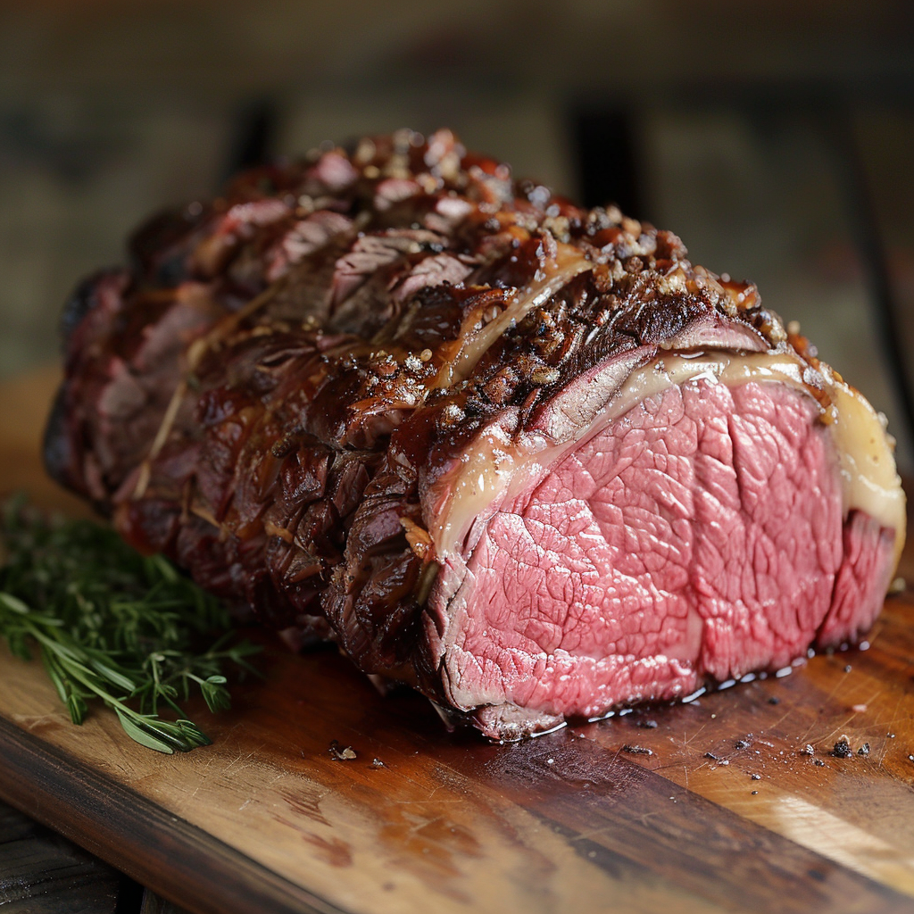

# laughing-octo-adventure-2024-april

# April 2024 Content

### Spreadsheet Google Document

Share with [link](https://docs.google.com/spreadsheets/d/1nplCO4ocCLELOi5Av_hTsFKk2J8zX7WdR9ER8OcbFGM/edit?usp=sharing)

```text
https://docs.google.com/spreadsheets/d/1nplCO4ocCLELOi5Av_hTsFKk2J8zX7WdR9ER8OcbFGM/edit?usp=sharing
```

Share on web page

```html
<iframe src="https://docs.google.com/spreadsheets/d/e/2PACX-1vSmeLbocmti22VFm_07ED1dvRkTv__paq_dqNgi7WZCHuPZBtw7xDVMG_Jg-XuEn94QQO5lCfTAP9z9/pubhtml?gid=1649233543&amp;single=true&amp;widget=true&amp;headers=false"></iframe>
```

## April 1


- April 1: April Fools' Day, International Fun at Work Day, National Burrito Day (first Thursday)
- Birthdays: Sergei Rachmaninoff1, Hillary Scott
- Events: Eddy Duchin, an American jazz pianist and bandleader, was born in Cambridge, Massachusetts.

### Facebook Text

```text
Happy Monday, everyone! 🎉 Today is not just any ordinary day; it's April 1, 2024 - a day packed with reasons to celebrate. First and foremost, it's April Fools' Day! Get ready for some lighthearted pranks and hilarious jokes. 😄 But there's more! It's also International Fun at Work Day, so let's make our workplace a little brighter with some joy and laughter. 🎈

And if that wasn't enough reason to celebrate, today we also honor the birth of two incredible talents: Sergei Rachmaninoff, the legendary composer and pianist, and Hillary Scott, the amazing voice behind Lady A. 🎶 Let's fill our day with beautiful music and good vibes.

Here's to a day full of fun, pranks, and music! How are you planning to make today special? #AprilFoolsDay #FunAtWork #Rachmaninoff #HillaryScott #Celebrate
```

## April 2


- April 2: World Autism Awareness Day, International Children's Book Day, National Peanut Butter and Jelly Day
- Birthdays: Emmylou Harris, Marvin Gaye
- Events: Concerts and live music events in Phoenix.

### Facebook Text

```text
Good morning, everyone! 🌞 Today is Tuesday, April 2, 2024, and it's a day filled with meaningful celebrations and remembrances. Let's embrace the beauty of diversity and understanding on World Autism Awareness Day. 💙 It's a day to spread love, promote acceptance, and advocate for the voices of those on the autism spectrum.

But wait, there's more! Today is also International Children's Book Day, a wonderful opportunity to ignite the love of reading in young hearts. 📚 Whether it's a classic tale or a new adventure, let's share our favorite stories with the little ones in our lives.

And for a touch of sweetness, it's National Peanut Butter and Jelly Day! 🥜🍇 Why not enjoy this classic combo for lunch or a snack and relive some childhood memories?

To top it all off, we celebrate the birthdays of two musical legends - Emmylou Harris and Marvin Gaye. Their timeless music continues to inspire and move hearts around the world. 🎶

Let's make today special by spreading awareness, sharing stories, enjoying simple pleasures, and celebrating the gift of music. How are you marking this day? #WorldAutismAwarenessDay #InternationalChildrensBookDay #NationalPBandJDay #EmmylouHarris #MarvinGaye
```

## April 3


- April 3: National Find a Rainbow Day, World Party Day
- Birthdays: Doris Day, Wayne Newton
- Events: Music festivals and performances.

### Facebook Text

```text
Happy Wednesday, folks! 🌈 April 3, 2024, brings us the joy of National Find a Rainbow Day. Whether it's after a spring shower or through a prism, today's the perfect day to seek out vibrant hues that light up the sky. Let the hunt for rainbows remind us of the beauty and hope that surrounds us.

And the party doesn't stop there because it's also World Party Day! 🎉 This day is all about celebrating life and the joy of human connections. So, why not throw a small gathering, have a dance party in your living room, or just share a moment of laughter over the phone with someone you love?

Adding a note of musical celebration, we honor the birthdays of two iconic performers today: the radiant Doris Day and the charismatic Wayne Newton. Their timeless talent and unforgettable melodies continue to bring smiles to faces around the globe. 🎶

Let's make the most of this wonderful day by finding our own rainbows, embracing the spirit of joy and connection, and tuning into some classic tunes. How are you planning to celebrate today? #FindARainbowDay #WorldPartyDay #DorisDay #WayneNewton
```

## April 4


- April 4: National Hug a Newsperson Day, National School Librarian Day
- Birthdays: Muddy Waters, Cazuza
- Events: Local entertainment events.

### Facebook Text

```text
Happy Thursday, everyone! 📚🤗 April 4, 2024, is a day to show some love and appreciation to those who keep us informed and enlightened - it's National Hug a Newsperson Day and National School Librarian Day! Whether it’s a virtual hug or a shoutout on social media, let’s take a moment to thank newspersons for their dedication to bringing us the news and school librarians for nurturing our love of reading and learning.

And as if today wasn’t special enough, we also celebrate the birthdays of two legendary musicians: the king of blues Muddy Waters and the Brazilian rock icon Cazuza. Their music broke barriers and continues to inspire generations. 🎶🎤

So, let’s make today memorable by spreading appreciation, diving into a good book, or enjoying the soul-stirring tunes of Muddy Waters and Cazuza. How will you make the most of this day? #HugaNewspersonDay #NationalSchoolLibrarianDay #MuddyWaters #Cazuza
```

## April 5


- April 5: National Deep Dish Pizza Day, National Walking Day
- Birthdays: Pharrell Williams, Agnetha Fältskog
- Events: Various cultural and music events.

### Facebook Text

```text
Happy Friday, everyone! 🍕🚶‍♂️ April 5, 2024, is here to kick off our weekend with some delightful celebrations. It's National Deep Dish Pizza Day, so why not indulge in a slice (or two) of that deliciously thick and cheesy goodness? There's no better way to celebrate Friday than with pizza that's practically a meal in every bite.

But let's balance it out because it's also National Walking Day! Take a moment to stretch your legs, enjoy the fresh air, and appreciate the beauty around you. Whether it's a brisk walk in the park or a leisurely stroll around your neighborhood, walking is a simple joy that benefits both body and mind.

And there's more reason to celebrate with the birthdays of two incredible artists: the ever-vibrant Pharrell Williams, whose music and style have left an indelible mark on the industry, and Agnetha Fältskog, the voice that charmed millions as part of ABBA. 🎶🎉

Let's dive into this fabulous Friday with great food, some healthy activity, and the timeless tunes of Pharrell and ABBA. How are you planning to make today special? #NationalDeepDishPizzaDay #NationalWalkingDay #PharrellWilliams #AgnethaFältskog
```

## April 6


- April 6: National Tartan Day, National Student Athlete Day
- Birthdays: Merle Haggard, Black Francis
- Events: Concerts and shows in Phoenix.

### Facebook Text

```text
Happy Saturday, everyone! 🏴🏅 April 6, 2024, is a day full of celebrations that bring together heritage, sportsmanship, and music. It’s National Tartan Day, a time to honor Scottish heritage and the significant contributions of Scottish Americans to the United States. Whether you have Scottish roots or simply appreciate the rich culture, today is a perfect day to show off some tartan patterns.

Also shining the spotlight on National Student Athlete Day, let’s take a moment to appreciate the dedication, discipline, and achievements of student athletes everywhere. Their hard work on the field and in the classroom is truly inspiring. 📚🏈⚽️🏀

And speaking of inspiration, today we celebrate the birthdays of two music legends: the country music icon Merle Haggard and the influential rock musician Black Francis of the Pixies. Their groundbreaking music and powerful lyrics have left an indelible mark on the world. 🎶🎤

Let’s make this Saturday special by embracing our heritage, cheering on young athletes, and enjoying some classic tunes. How are you celebrating today? #NationalTartanDay #NationalStudentAthleteDay #MerleHaggard #BlackFrancis
```

## April 7


- April 7: National Beer Day, No Housework Day
- Birthdays: John Oates, Jackie Chan
- Events: Entertainment events around the city.

### Facebook Text

```text
Happy Sunday, folks! 🍺✨ April 7, 2024, is here to make sure our weekend ends on a high note with two very enjoyable reasons to celebrate. It's National Beer Day, a perfect excuse to enjoy your favorite brews. Whether you're a fan of hoppy IPAs, smooth stouts, or crisp lagers, today's the day to toast to the craft and tradition of brewing.

And guess what? It's also No Housework Day! Put down those cleaning supplies and give yourself a break from the daily chores. Instead, spend some time doing what you love or simply relaxing. You deserve it! 🚫🧹

Music lovers, there's more! We're also celebrating the birthdays of two incredible talents: the soulful John Oates, half of the legendary duo Hall & Oates, and the incomparable Jackie Chan, whose martial arts skills and comedic timing have captured hearts worldwide. 🎶🎬

Let's make the most of this Sunday by raising a glass, kicking back, and enjoying the entertainment legends we've been blessed with. How are you planning to celebrate today? #NationalBeerDay #NoHouseworkDay #JohnOates #JackieChan
```

## April 8


- Birthdays: Julian Lennon, Biz Markie
- Events: Music and arts festivals.

### Facebook Text

```text
Happy Monday, everyone! 🌒✨ April 8, 2024, is not just the start of a new week; it’s a day marked by an extraordinary celestial event - the Solar Eclipse of April 8, 2024. A reminder of the wonders of our universe, today offers a rare spectacle that brings together people from all walks of life to gaze upwards in awe. Make sure to have your eclipse glasses ready and witness the magic as the moon passes between the Earth and the sun.

And as we look to the stars, let’s also celebrate the birthdays of two stellar talents in the music world: Julian Lennon, with his poignant melodies and thoughtful lyrics, and Biz Markie, known for his beatboxing prowess and infectious energy. 🎶🎉

Let this day be a blend of celestial wonder and musical celebration. Take a moment to step outside, feel connected to the cosmos, and enjoy some tunes from Julian and Biz. How are you planning to experience this unique day? #SolarEclipse2024 #JulianLennon #BizMarkie
```

## April 9


- Birthdays: Gerard Way, Lil Nas X, Kristen Stewart, Dennis Quaid, Elle Fanning, Hugh Hefner, Leighton Meester

### Facebook Text

```text
Good morning, everyone! 🌟 Today, Tuesday, April 9, 2024, we have a special reason to reflect and celebrate - it's Identity Management Day. A day dedicated to raising awareness and promoting best practices for identity management and security. Let’s all take a moment to ensure our digital identities are protected and secure in this ever-connected world. 🔒💻

And as if today wasn't vibrant enough, it's also a day teeming with star-studded birthdays! Let's wish a big happy birthday to an array of talents who've made significant marks in music, film, and beyond: the creative powerhouse Gerard Way, chart-topping sensation Lil Nas X, the effortlessly cool Kristen Stewart, charismatic veteran Dennis Quaid, the dazzling Elle Fanning, the iconic Hugh Hefner, and the captivating Leighton Meester. 🎉🎂🎈

Each of these stars shines bright in their own way, adding layers of depth and entertainment to our lives. From groundbreaking music to captivating performances on screen, they’ve all brought something unique to the table.

Let's make today memorable by reflecting on our digital well-being and celebrating the incredible contributions of these artists. How will you mark this day? #IdentityManagementDay #StarStuddedBirthdays
```


## April 10


- April 10: National Siblings Day, National Farm Animals Day
- Birthdays: Mandy Moore, Babyface
- Events: Cultural events and festivals.

### Facebook Text

```text
Happy Wednesday, folks! 🌷🐾 April 10, 2024, brings us two heartwarming celebrations - it’s National Siblings Day and National Farm Animals Day! A day to cherish those lifelong bonds with our brothers and sisters, whether by blood or chosen, reminding us of the irreplaceable role they play in our lives. Give them a call, send a message, or share a memory to show how much they mean to you. 💕

Today also invites us to appreciate the beauty and importance of farm animals. From the cows that provide milk to the chickens that lay eggs, each creature contributes to our daily lives in their own unique way. It’s a perfect day to support local farms or learn more about how we can help improve the lives of farm animals. 🐔🐄🐖

And there’s a musical note to today’s celebrations as well - wishing a very happy birthday to the wonderfully talented Mandy Moore and the iconic Babyface! Their contributions to music and entertainment have given us countless moments of joy and inspiration. 🎶🎉

Let’s embrace this beautiful Wednesday by showing some love to our siblings, appreciating the animals that enrich our lives, and enjoying the melodies that bring us together. How are you planning to celebrate today? #NationalSiblingsDay #NationalFarmAnimalsDay #MandyMoore #Babyface
```

## April 11


- April 11: National Pet Day, National Cheese Fondue Day
- Birthdays: Joss Stone, Jeremy Clarkson
- Events: Local entertainment events.

### Facebook Text

```text
Happy Thursday, everyone! 🐾🧀 April 11, 2024, is here to sprinkle some extra love and deliciousness into our week. It's National Pet Day, a perfect occasion to shower our furry, feathery, or scaly friends with all the love and attention they deserve. Whether it's extra treats, a new toy, or just more quality time together, let's make sure our pets know how much they mean to us.

But that's not all – today also melts our hearts with National Cheese Fondue Day! Dive into the gooey goodness of cheese fondue, a delightful treat that's best enjoyed shared. It's a great excuse to gather around the table with friends or family and dip into a pot of cheesy deliciousness.

And as we celebrate these delightful occasions, let's also send birthday wishes to the soulful Joss Stone and the spirited Jeremy Clarkson. Their talents and personalities have captured the hearts of many, adding a dash of zest and melody to our lives.

So, let’s make this day unforgettable by celebrating the pets that bring joy to our lives, indulging in some cheesy goodness, and enjoying the work of Joss and Jeremy. How will you make today special? #NationalPetDay #NationalCheeseFondueDay #JossStone #JeremyClarkson
```

## April 12


- April 12: National Grilled Cheese Sandwich Day, National Licorice Day
- Birthdays: Brendon Urie, Herbie Hancock
- Events: Music events in Phoenix.

### Facebook Text

```text
Happy Friday, everyone! 🧀🍫 April 12, 2024, is serving up a delicious duo of celebrations that are sure to add some flavor to our day. It’s National Grilled Cheese Sandwich Day, a tribute to the classic comfort food that has a special place in our hearts (and stomachs). Whether you like it simple with just cheese and bread or dressed up with tomatoes, bacon, or whatever your heart desires, today’s the day to enjoy it to the fullest.

But let's sweeten the deal because it's also National Licorice Day! Whether you’re a fan of the classic black licorice or prefer the fruity flavors, it’s a great day to treat yourself to this chewy, distinctive confection.

And as if this day couldn’t get any better, we’re also celebrating the birthdays of the incredibly talented Brendon Urie and the legendary Herbie Hancock. From Brendon’s dynamic vocals to Herbie’s revolutionary jazz compositions, their music has inspired and entertained us in so many ways.

Let’s make this Friday fantastic by indulging in some grilled cheese goodness, enjoying a bit of licorice, and jamming out to some amazing tunes. How are you planning to celebrate today? #NationalGrilledCheeseDay #NationalLicoriceDay #BrendonUrie #HerbieHancock
```

## April 13


- April 13: National Scrabble Day, Thomas Jefferson's Birthday
- Birthdays: Al Green, Aaron Lewis
- Events: Entertainment and cultural events.

### Facebook Text

```text
Happy Saturday, word lovers and history buffs! 📚🎉 April 13, 2024, is a day full of reasons to celebrate. It's National Scrabble Day, a day to honor the beloved board game that challenges our vocabularies and brings friends and families together for some competitive fun. Gather your tiles, and may the best wordsmith win!

And on this day, we also commemorate the birthday of Thomas Jefferson, the third President of the United States and a key architect of the Declaration of Independence. His contributions to the founding of our nation and his legacy in American history are remembered today.

Adding a musical note to our celebrations, let's wish a happy birthday to the soulful Al Green and the talented Aaron Lewis. Their music, spanning from soulful melodies to heartfelt country and rock, has touched the hearts of many and left an indelible mark on the music world.

Let's make the most of this Saturday by engaging in some Scrabble showdowns, reflecting on our nation's history, and enjoying the timeless music of Al Green and Aaron Lewis. How are you planning to celebrate today? #NationalScrabbleDay #ThomasJefferson #AlGreen #AaronLewis
```


## April 14


- April 14: National Pecan Day, National Dolphin Day
- Birthdays: Loretta Lynn, Ritchie Blackmore
- Events: Concerts and live performances.

### Facebook Text

```text
Happy Sunday, everyone! 🌳🐬 April 14, 2024, brings us a delightful blend of nature's treats and wildlife wonders. It's National Pecan Day, a perfect time to celebrate one of nature's tastiest treasures. Whether you enjoy them in a pie, as a snack, or in any of the myriad ways these versatile nuts can be used, today is the day to savor their deliciousness.

But that's not all - it's also National Dolphin Day! This day is dedicated to raising awareness about dolphins, their intelligence, their importance to the marine ecosystem, and the threats they face in the wild. It’s a wonderful opportunity to learn about these incredible creatures and support efforts to protect them and their habitats.

And as we enjoy the beauty of nature and its inhabitants, let's also pay tribute to the legendary talents born on this day: the incomparable Loretta Lynn, whose groundbreaking contributions to country music have inspired generations, and Ritchie Blackmore, whose guitar wizardry has left an indelible mark on rock and roll.

Let's make this Sunday special by enjoying the simple pleasures of pecans, appreciating the beauty of dolphins, and celebrating the musical heritage of Loretta Lynn and Ritchie Blackmore. How are you planning to spend today? #NationalPecanDay #NationalDolphinDay #LorettaLynn #RitchieBlackmore
```


## April 15


- April 15: National Tax Day, National Banana Day
- Birthdays: Emma Watson, Seth Rogen
- Events: Local arts and music events.

### Facebook Text

```text
Happy Monday, everyone! 🍌💼 April 15, 2024, marks a mix of duties and delights as we navigate through National Tax Day and National Banana Day. As we check off those tax filings, let's also peel into the lighter side of today with a celebration of bananas - a versatile fruit that brightens up our meals and snacks with its natural sweetness and health benefits.

And there's more reason to celebrate! Let's send a big birthday shoutout to two of our favorite stars who've brought us so much joy and laughter on screen: the wonderfully talented Emma Watson, whose roles have captured our hearts and inspired us, and the hilarious Seth Rogen, whose unique humor and creativity have a way of making any day better.

So, while we fulfill our civic duties, let's not forget to enjoy the simple pleasures, like a delicious banana or a good laugh from our favorite movies. How are you planning to make the most of today? #NationalTaxDay #NationalBananaDay #EmmaWatson #SethRogen
```


## April 16


- April 16: National Wear Your Pajamas to Work Day, National Stress Awareness Day
- Birthdays: Selena, Akon
- Events: Music festivals and concerts.

### Facebook Text

```text
Happy Tuesday, everyone! 😴🧘 April 16, 2024, offers us a unique blend of comfort and mindfulness as we celebrate National Wear Your Pajamas to Work Day and National Stress Awareness Day. Today, we embrace the ultimate comfort by wearing our pajamas to work, blending a bit of home comfort with our professional lives. Whether you’re working from home or in an office that embraces fun, it’s a day to enjoy the cozy and laid-back vibe!

But let's also take a moment to acknowledge National Stress Awareness Day. In our fast-paced world, it's vital to recognize the importance of managing stress for our overall health and well-being. Take some time to breathe, stretch, or engage in activities that help you unwind and relax.

And as we chill in our PJs and find our zen, let’s also celebrate the birthdays of two incredible artists: the legendary Selena, whose music and spirit continue to inspire, and the dynamic Akon, whose contributions to music and philanthropy have made significant impacts worldwide.

Let's make today about comfort, mindfulness, and celebrating the legacy of artists who've touched our hearts. How are you planning to spend this cozy and reflective day? #WearYourPajamasToWorkDay #NationalStressAwarenessDay #Selena #Akon
```


## April 17


- April 17: National Haiku Poetry Day, National Cheeseball Day
- Birthdays: Jennifer Garner, Victoria Beckham
- Events: Local music events.

### Facebook Text

```text
Happy Wednesday, poetry and cheese lovers! 📝🧀 April 17, 2024, brings us the joy of National Haiku Poetry Day and National Cheeseball Day. Today, we celebrate the art of haiku, a form of poetry that captures the essence of moments in a few short lines. Why not try your hand at writing a haiku? Reflect on nature, emotions, or even the quirkiness of daily life, and share your creation with friends.

And in a delightful contrast, it's also National Cheeseball Day! Whether you prefer them savory or sweet, coated with nuts, herbs, or spices, cheeseballs make for a fun and tasty snack. They're perfect for sharing, so perhaps a cheeseball-making session is in order?

Adding a sprinkle of star power to our day, let's wish a very happy birthday to the talented Jennifer Garner and the chic Victoria Beckham. Both have made their mark in their respective fields, bringing talent and style to our screens and wardrobes.

Let's make this Wednesday wonderful by exploring our creative sides with haiku and indulging in the playful culinary delight of cheeseballs. And of course, by celebrating the achievements of Jennifer and Victoria. How are you planning to enjoy today? #NationalHaikuPoetryDay #NationalCheeseballDay #JenniferGarner #VictoriaBeckham
```


## April 18


- April 18: National Animal Crackers Day, National Lineman Appreciation Day
- Birthdays: Conan O’Brien, America Ferrera
- Events: Cultural festivals.

### Facebook Text

```text
Happy Thursday, everyone! 🐘⚡ April 18, 2024, is here to celebrate the whimsical and the essential. It's National Animal Crackers Day, a nod to the childhood favorite that continues to bring joy to snack time, no matter your age. Whether you're dunking them in milk or nibbling them during a break, today's the day to appreciate these fun, animal-shaped treats.

And it’s also National Lineman Appreciation Day, a time to recognize the hardworking men and women who keep our power running. These unsung heroes brave the elements to ensure we have the electricity we need to light our homes and power our lives. Let’s take a moment to appreciate their dedication and the crucial work they do.

Adding a bit of star quality to our day, let’s wish a happy birthday to the brilliantly funny Conan O’Brien and the incredibly talented America Ferrera. Both have contributed immensely to entertainment, making us think, laugh, and cheer.

Let's make the most of this Thursday by enjoying some nostalgic snacks, showing gratitude to our linemen, and celebrating the creative spirits of Conan and America. How are you planning to brighten your day? #NationalAnimalCrackersDay #NationalLinemanAppreciationDay #ConanOBrien #AmericaFerrera
```


## April 19


- April 19: National Garlic Day, National Hanging Out Day
- Birthdays: Ashley Judd, Kate Hudson
- Events: Live concerts in Phoenix.

### Facebook Text

```text
Happy Friday, everyone! 🌱☀ April 19, 2024, brings us the aroma of National Garlic Day and the relaxed vibes of National Hanging Out Day. Today, we celebrate the mighty garlic, a staple in cuisines around the world known for its distinctive flavor and health benefits. Whether you’re whipping up a garlicky dish or just adding a little extra to your meals, let’s give it up for garlic!

And as we savor the zest of garlic, let’s also embrace the casual spirit of National Hanging Out Day. It’s a call to take it easy, maybe hang out your laundry to air in the spring breeze or simply spend some quality time outdoors with friends and family. It’s all about enjoying the simple pleasures and the company of loved ones.

Adding some star sparkle to our day, let’s send birthday wishes to the talented Ashley Judd and the radiant Kate Hudson. Their performances have captured our hearts and entertained us through the years.

Let’s make this Friday fabulous by indulging in our love for garlic, enjoying the outdoors, and celebrating the achievements of Ashley and Kate. How are you planning to enjoy today? #NationalGarlicDay #NationalHangingOutDay #AshleyJudd #KateHudson
```


## April 20


- April 20: National Look-Alike Day, National Pineapple Upside Down Cake Day
- Birthdays: Jessica Lange, Carmen Electra
- Events: Music and arts events.

### Facebook Text

```text
Happy Saturday, everyone! 🌟🍍 April 20, 2024, is here to double the fun with National Look-Alike Day and National Pineapple Upside Down Cake Day. It's a day to find your doppelgänger or twin spirit and celebrate the uncanny resemblances among us. Whether it’s with a friend, a celebrity, or even a pet, today is the perfect day to share those look-alike moments.

And let's sweeten the deal with National Pineapple Upside Down Cake Day! This classic dessert, with its caramelized pineapple topping and cherry centers, is a delightful treat that brings a taste of nostalgia and joy. Why not bake this upside-down wonder and share the sweetness with loved ones?

Adding to today’s celebrations, we also send birthday wishes to the incredibly talented Jessica Lange and the vibrant Carmen Electra. Their remarkable careers in film and entertainment have brought us countless memorable moments.

Let's make this Saturday special by embracing our look-alikes, indulging in some delicious pineapple upside-down cake, and celebrating the achievements of Jessica and Carmen. How are you planning to make today unforgettable? #NationalLookAlikeDay #NationalPineappleUpsideDownCakeDay #JessicaLange #CarmenElectra
```


## April 21


- April 21: National Kindergarten Day, National Chocolate Covered Cashews Day
- Birthdays: Iggy Pop, Tony Danza
- Events: Entertainment events in Florida.

### Facebook Text

```text
Happy Sunday, everyone! 🎒🍫 April 21, 2024, brings us the joys of National Kindergarten Day and National Chocolate Covered Cashews Day. Today, we celebrate the wonder and importance of kindergarten, the place where many of us took our first steps into the world of learning, friendships, and creativity. It’s a day to appreciate the teachers, aides, and staff who make kindergarten such a special experience for little ones.

And as we reminisce about our first school days, let’s also indulge in the sweet delight of National Chocolate Covered Cashews Day. These treats combine the creamy crunch of cashews with the smooth richness of chocolate, making for an irresistible snack. Perfect for a lazy Sunday treat!

Adding some rock and charm to our day, we also celebrate the birthdays of the legendary Iggy Pop and the talented Tony Danza. Their contributions to music and television have left indelible marks, entertaining and inspiring generations.

Let's make this Sunday special by reflecting on the foundational experiences of kindergarten, enjoying some delicious chocolate-covered cashews, and rocking out to some classic tunes. How are you planning to celebrate today? #NationalKindergartenDay #NationalChocolateCoveredCashewsDay #IggyPop #TonyDanza
```


## April 22


- April 22: Earth Day, National Jelly Bean Day
- Birthdays: Jack Nicholson, Peter Frampton
- Events: Concerts and festivals.

### Facebook Text

```text
Happy Earth Day, everyone! 🌍💚 April 22, 2024, is a call to celebrate our beautiful planet and the small but sweet delights in life. Today, as we observe Earth Day, let's take a moment to reflect on the ways we can contribute to preserving the beauty and health of our world. Whether it's planting a tree, reducing your carbon footprint, or participating in local clean-up efforts, every action counts towards a healthier Earth.

And for a bit of whimsy, it’s also National Jelly Bean Day! Dive into the colorful and flavorful world of jelly beans, a treat that reminds us of the simple joys in life. From classic fruit flavors to the more adventurous ones, there’s a jelly bean for every palate.

Adding some star power to today’s celebrations, let’s wish a happy birthday to the iconic Jack Nicholson and the talented Peter Frampton. Their remarkable contributions to film and music have not only entertained us but also made a lasting impact on their respective industries.

Let’s make this Monday meaningful by doing our part for the planet and enjoying the sweet things in life, all while celebrating the achievements of two great artists. How are you planning to mark Earth Day and indulge in some jelly bean fun? #EarthDay #NationalJellyBeanDay #JackNicholson #PeterFrampton
```


## April 23


- April 23: National Picnic Day, National Talk Like Shakespeare Day
- Birthdays: John Cena, George Lopez
- Events: Local entertainment in Minneapolis.

### Facebook Text

```text
Good morrow, friends! 🌳📖 This Tuesday, April 23, 2024, doth bring us merriment and joy with the celebration of National Picnic Day and National Talk Like Shakespeare Day. Gather thy kin and comrades for a feast 'neath the open sky, and partake in the delights of a picnic, reveling in nature's beauty and the company of loved ones.

And hark! Let us also embrace the whimsy of National Talk Like Shakespeare Day. Pray, bedeck thy speech with the elegance and flourish of the Bard's tongue. Whether thou art a seasoned thespian or simply a lover of words, this day is thine to celebrate the timeless wit and wisdom of William Shakespeare.

Adding to our revels, we also commemorate the nativity of two illustrious personages: the valiant John Cena and the jestful George Lopez. Their feats in the arena of entertainment have brought laughter, inspiration, and joy to many a soul.

So, let us make this day one of joyous assembly, delectable fare, and eloquent discourse, all whilst paying homage to the talents of Cena and Lopez. How dost thou plan to celebrate these fine occasions? #NationalPicnicDay #TalkLikeShakespeareDay #JohnCena #GeorgeLopez
```


## April 24


- April 24: National Pigs in a Blanket Day, National Administrative Professionals Day
- Birthdays: Kelly Clarkson, Barbra Streisand
- Events: Music events in every state.

### Facebook Text

```text
Happy Wednesday, everyone! 🌭📋 April 24, 2024, wraps up comfort food and appreciation in one delightful package. It's National Pigs in a Blanket Day, a time to indulge in the simple pleasure of sausages wrapped in dough. Whether you enjoy them as a snack, appetizer, or part of your meal, today's the day to savor this cozy, culinary delight.

And let's not forget it's also National Administrative Professionals Day! Today we give a huge shoutout to all the administrative professionals - the unsung heroes who keep our offices running smoothly. Your hard work, organization, and dedication are truly appreciated. Make sure to show some gratitude to the administrative pros in your life today.

Adding a note of melody and star power to our celebrations, let’s wish a happy birthday to the incredibly talented Kelly Clarkson and the legendary Barbra Streisand. Both have gifted us with their powerful voices and unforgettable performances, enriching our lives with music and art.

Let's make this Wednesday wonderful by enjoying some pigs in a blanket, showing appreciation for our administrative professionals, and jamming out to some Kelly and Barbra classics. How are you planning to celebrate today? #NationalPigsInABlanketDay #AdministrativeProfessionalsDay #KellyClarkson #BarbraStreisand
```


## April 25


- April 25: National Telephone Day, National Hug a Plumber Day
- Birthdays: Al Pacino, Renée Zellweger
- Events: April events in Melbourne.

### Facebook Text

```text
Happy Thursday, everyone! 📞🔧 April 25, 2024, is a day to celebrate connections and those who keep our homes running smoothly. It's National Telephone Day, a nod to one of the greatest inventions that has kept us connected through the years. Take a moment to appreciate the simple phone call, a tool that bridges distances and brings voices of loved ones into our lives.

And let’s also give a big shoutout to the unsung heroes of home maintenance on National Hug a Plumber Day. These skilled professionals tackle everything from leaky faucets to complex piping issues, ensuring our comfort and safety. If you know a plumber, today’s the perfect day to show your appreciation for their hard work and dedication.

Adding a dash of star power to our day, we celebrate the birthdays of the legendary Al Pacino and the talented Renée Zellweger. Both have captivated us with their unforgettable performances, leaving a lasting mark on the world of cinema.

Let’s make this Thursday memorable by reaching out to someone special with a phone call, expressing our gratitude to the plumbers in our lives, and maybe revisiting a classic film featuring Al or Renée. How are you planning to celebrate today? #NationalTelephoneDay #HugAPlumberDay #AlPacino #RenéeZellweger
```


## April 26


- April 26: National Pretzel Day, National Kids and Pets Day
- Birthdays: Channing Tatum, Melania Trump
- Events: Live music in Phoenix.

### Facebook Text

```text
Happy Friday, everyone! 🥨🐾 April 26, 2024, brings us the twisty delights of National Pretzel Day and the joyous celebration of National Kids and Pets Day. It’s the perfect day to indulge in your favorite pretzel, be it soft, hard, salty, or sweet. Why not share this twisty treat with friends or family and kickstart the weekend on a delicious note?

And as we savor the salty goodness, let’s also embrace the loving and playful relationships between kids and pets on National Kids and Pets Day. Today is about celebrating the special bond that forms between children and their furry (or feathery, or scaly) friends. It’s a bond that teaches responsibility, compassion, and unconditional love. Share your favorite moments and photos of your kids with their pets to spread some heartwarming joy.

Adding a sprinkle of star power to our celebrations, let’s wish a happy birthday to the incredibly talented Channing Tatum and the elegant Melania Trump. Both have made significant contributions to their fields and continue to captivate and inspire.

Let’s make this Friday fabulous by enjoying the simple pleasures of pretzels, cherishing the bond between kids and pets, and celebrating the achievements of Channing and Melania. How are you planning to make today special? #NationalPretzelDay #NationalKidsAndPetsDay #ChanningTatum #MelaniaTrump
```


## April 27



- April 27: National Tell a Story Day, National Prime Rib Day
- Birthdays: Patrick Stump, Lizzo
- Events: Cultural events and festivals.

### Facebook Text

```text
Happy Saturday, everyone! 📚🍖 April 27, 2024, brings us the magic of tales and the savoriness of succulent meals. It's National Tell a Story Day, a day dedicated to the power of storytelling. Whether it’s a cherished childhood memory, a piece of family history, or a completely made-up tale, today is the perfect occasion to share stories with those around you. Gather friends and family, or reach out virtually, and spin tales that entertain, educate, and inspire.

And as if that weren't enticing enough, it's also National Prime Rib Day! A day for all the meat lovers to indulge in a beautifully cooked prime rib, seasoned and roasted to perfection. Whether you're dining out or cooking at home, enjoy the tenderness and flavor of this classic dish.

Adding a note of celebration to today's festivities, let’s send our happiest birthday wishes to the talented Patrick Stump and the incredible Lizzo. Both artists have rocked our world with their music, leaving an indelible mark on the hearts of fans worldwide.

Let’s make this Saturday special by diving into the art of storytelling and treating ourselves to a prime rib feast, all while celebrating the musical genius of Patrick and Lizzo. How are you planning to enjoy today? #NationalTellAStoryDay #NationalPrimeRibDay #PatrickStump #Lizzo
```


## April 28


- April 28: National Superhero Day, National Blueberry Pie Day
- Birthdays: Penélope Cruz, Jessica Alba
- Events: Entertainment events around the city.

### Facebook Text

```text
Happy Sunday, everyone! 🦸‍♂️🥧 April 28, 2024, is a day filled with heroics and sweetness. It’s National Superhero Day, a time to celebrate the heroes in our lives and in our imaginations. From comic book champions to the everyday heroes who inspire us, today is about honoring the courage, kindness, and strength that make a true superhero. Don your capes, share your favorite superhero stories, or pay tribute to the real-life heroes making a difference in your community.

And let’s not forget the delicious part of today - it’s National Blueberry Pie Day! This classic dessert, with its flaky crust and juicy blueberry filling, is a perfect treat to enjoy with family and friends. Why not bake or enjoy a slice of blueberry pie in honor of this sweet day?

Adding a touch of star power to our celebrations, let’s wish a very happy birthday to the talented Penélope Cruz and the fabulous Jessica Alba. Both have captured our hearts with their performances on screen, bringing characters to life with depth and passion.

Let’s make this Sunday super by embracing our inner superheroes, indulging in some blueberry pie, and celebrating the achievements of Penélope and Jessica. How are you planning to make today extraordinary? #NationalSuperheroDay #NationalBlueberryPieDay #PenélopeCruz #JessicaAlba
```


## April 29


- April 29: National Shrimp Scampi Day, National Zipper Day
- Birthdays: Jerry Seinfeld, Uma Thurman
- Events: Music and arts festivals.

### Facebook Text

```text
Happy Monday, everyone! 🍤🔒 April 29, 2024, zips us into a week full of flavor and innovation. It's National Shrimp Scampi Day, a day to delight in the garlic-buttery goodness of this beloved seafood dish. Whether you’re a master chef at home or you’re planning to order from your favorite restaurant, today is the perfect excuse to indulge in some delicious shrimp scampi.

And as we savor the rich flavors, let's also zip up some appreciation for National Zipper Day! This day celebrates the invention that's been holding things together since the early 20th century. From fashion to luggage and beyond, zippers are a part of our daily lives we often take for granted.

Adding a bit of comedic and cinematic flair to our day, let's send birthday wishes to the hilarious Jerry Seinfeld and the talented Uma Thurman. Both have given us unforgettable performances and moments on screen that have made us laugh, think, and feel.

Let's make this Monday memorable by enjoying the simple pleasures of a tasty meal, appreciating the small things that make our lives easier, and celebrating the artistic contributions of Jerry and Uma. How are you planning to celebrate today? #NationalShrimpScampiDay #NationalZipperDay #JerrySeinfeld #UmaThurman
```


## April 30


- April 30: National Adopt a Shelter Pet Day, National Bubble Tea Day
- Birthdays: Gal Gadot, Kirsten Dunst
- Events: Concerts and live performances.

### Facebook Text

```text
Happy Tuesday, everyone! 🐾🍵 April 30, 2024, brings us a heartwarming and refreshing mix of celebrations. It’s National Adopt a Shelter Pet Day, a day to shine a light on the countless animals waiting in shelters for their forever homes. If you’ve been considering adding a furry friend to your family, today is a perfect reminder of the love and joy pets bring into our lives. Visit your local shelter, spread the word, or support in any way you can – every little bit helps give these animals a second chance at happiness.

And as we advocate for our four-legged friends, let’s also enjoy the sweetness of National Bubble Tea Day! This delightful beverage, with its tapioca pearls and myriad of flavors, is a perfect treat to enjoy. Whether you’re a fan of classic milk tea or adventurous fruit flavors, grab a bubble tea and toast to the simple pleasures in life.

Adding a touch of star power to today’s festivities, let’s send birthday wishes to the incredibly talented Gal Gadot and Kirsten Dunst. Both have captivated audiences with their powerful performances and diverse roles, leaving lasting impressions in the world of cinema.

Let’s make this Tuesday one of compassion, sweetness, and celebration by supporting shelter pets, enjoying a bubble tea, and appreciating the work of Gal and Kirsten. How are you planning to make today special? #AdoptAShelterPetDay #NationalBubbleTeaDay #GalGadot #KirstenDunst
```


#### Credits & Sources


This calendar includes a mix of artist birthdays and a variety of entertainment events. For specific details and updates on events, please check the provided references or local listings as dates and performers may change. Enjoy your month filled with music and entertainment!

In the United States, April doesn't have any federal holidays, but there are various observances and special days celebrated throughout the month. Here are some notable dates:


These are just a few of the many observances in April. For a complete list, you can visit [The Spruce](^1^) or check out other resources for daily holidays and observances¹. Enjoy celebrating!

Source: Conversation with Bing, 3/20/2024
- (1) April Holidays and Observances. https://www.thespruce.com/special-days-and-observances-in-april-1448882.
- (2) April Holidays and Observances. https://www.thespruce.com/special-days-and-observances-in-april-1448882.
- (3) . https://bing.com/search?q=US+holidays+in+April.
- (4) American holidays | USAGov. https://www.usa.gov/holidays.
- (5) April Holidays and Observances 2024: Full Calendar. https://www.today.com/life/holidays/april-holidays-and-observances-rcna64888.
- (6) The Month of April 2024: Holidays, Fun Facts, Folklore. https://www.almanac.com/content/month-april-holidays-fun-facts-folklore.
- (7) April 2024 Calendar (With Holidays) - Calendarr. https://www.calendarr.com/united-states/calendar-april-2024/.
- (8) undefined. https://www.timeanddate.com/holidays/us/.
- (9) undefined. https://www.federalpay.org/holidays.
- https://www.daysoftheyear.com/days/apr/09/


